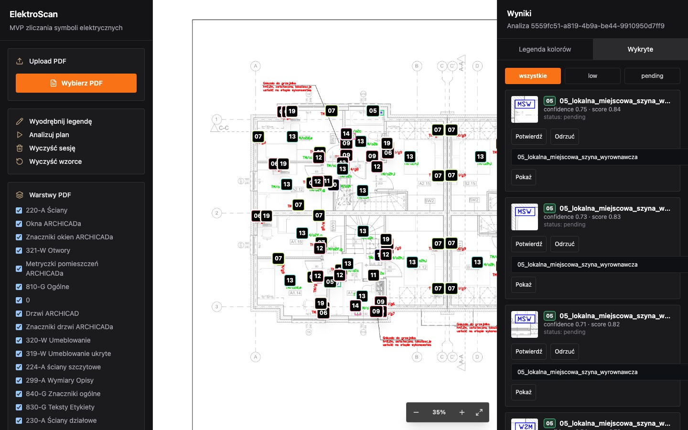

# ElektroScan

<p align="center">
  <a href="https://github.com/JakubLewosz/ElektroScan/actions/workflows/ci.yml">
    
  </a>
  
  
  
</p>

Główny projekt pokazowy portfolio: przeglądarkowa aplikacja do zliczania symboli elektrycznych z planu PDF.

Projekt automatyzuje fragment pracy, który normalnie wymaga ręcznego przeglądania planu: wgrania PDF, odczytania legendy, dobrania wzorców symboli i uruchomienia analizy z podglądem postępu.

## Podgląd



## Co Pokazuje Projekt

- pełny przepływ aplikacji webowej: frontend, backend, API i lokalny stan sesji,
- przetwarzanie PDF oraz renderowanie planu do dalszej analizy,
- wykrywanie symboli z użyciem OpenCV, PyMuPDF i NumPy,
- endpointy FastAPI oraz komunikację postępu przez Server-Sent Events,
- frontend w React, TypeScript, Vite i Tailwind CSS,
- testy, benchmark referencyjny, smoke test API oraz uruchamianie przez Docker Compose,
- pracę ze specyfikacją zmian w OpenSpec.

## Status

Projekt jest przygotowany jako MVP pokazowe zoptymalizowane pod referencyjny plik `backend/samples/plan.pdf`.
Kanoniczna legenda i liczniki dla tego pliku są zapisane w `backend/samples/canonical_legend.json` oraz
`backend/samples/expected_counts.json`; aktualny zaakceptowany wynik referencyjny to 134 detekcje.

## Technologie

- Backend: Python, FastAPI, Pydantic, PyMuPDF, OpenCV, NumPy.
- Frontend: React, TypeScript, Vite, Tailwind CSS, Playwright.
- Narzędzia: Docker Compose, OpenSpec, skrypty weryfikacyjne, benchmark referencyjny.

## Case Study

**Problem:** ręczne liczenie symboli elektrycznych na planach PDF jest powtarzalne, czasochłonne i podatne na pomyłki.

**Rozwiązanie:** ElektroScan pozwala wgrać plan PDF, wyrenderować go w przeglądarce, wyodrębnić symbole z legendy, uruchomić analizę i przejrzeć wyniki wraz z oznaczeniami na planie.

**Moja rola:** przygotowałem projekt jako główny przykład portfolio, skupiając się na połączeniu backendu, przetwarzania PDF, detekcji obrazu, interfejsu użytkownika i automatycznej weryfikacji.

**Efekt MVP:** dla referencyjnego planu `backend/samples/plan.pdf` aplikacja ma zaakceptowany wynik 134 detekcji, testy backendu, testy E2E frontendu, benchmark oraz workflow CI.

## OpenSpec

Projekt używa OpenSpec jako lokalnej warstwy specyfikacji:

- `openspec/specs/` opisuje aktualne zachowanie systemu.
- `openspec/changes/` służy do planowania kolejnych zmian.
- `AGENTS.md` mówi agentom, żeby przed pracą czytali właściwe specyfikacje.

Przy większej zmianie utwórz katalog `openspec/changes/<change-id>/` z `proposal.md`, `tasks.md`, opcjonalnym `design.md` i deltami specyfikacji w `specs/`. Po zakończeniu zmiany przenieś ją do `openspec/changes/archive/` i zaktualizuj `openspec/specs/`.

## Weryfikacja

Podstawowy zestaw kontroli po zmianach:

```bash
./scripts/verify.sh
```

Skrypt sprawdza kompilację backendu, lint/typecheck/testy backendu, benchmark referencyjny dla `backend/samples/plan.pdf` oraz lint/build frontendu.
Backendowy virtualenv powinien mieć zainstalowane `backend/requirements-dev.txt`.

Jeśli backend działa lokalnie na `http://127.0.0.1:8010`, można dołożyć smoke test API:

```bash
ELEKTROSCAN_API_SMOKE=1 ./scripts/verify.sh
```

Fallback detector bez profilu referencyjnego można zmierzyć osobno:

```bash
cd backend
.venv/bin/python fallback_benchmark.py --strict
```

Albo dołożyć ten wolniejszy benchmark do pełnego verify:

```bash
ELEKTROSCAN_FALLBACK_BENCHMARK=1 ./scripts/verify.sh
```

Sam smoke test API można też uruchomić bez buildów:

```bash
backend/.venv/bin/python scripts/api_smoke.py
```

Opcja `--clear` usuwa świeżo utworzoną sesję testową, więc używaj jej tylko wtedy, gdy świadomie chcesz skasować te lokalne dane robocze.

## Backend

```bash
cd backend
python -m venv .venv
source .venv/bin/activate
pip install -r requirements.txt
pip install -r requirements-dev.txt
uvicorn main:app --reload
```

## Frontend

```bash
cd frontend
npm install
npm run test:e2e:install
npm run dev
```

Testy E2E frontendu:

```bash
cd frontend
npm run test:e2e
```

## Docker

Cały projekt można uruchomić lokalnie przez Docker Compose:

```bash
docker compose up -d
```

Po starcie:

- frontend: `http://127.0.0.1:5174/`
- backend health: `http://127.0.0.1:8010/api/health`

Zatrzymanie usług:

```bash
docker compose down
```
